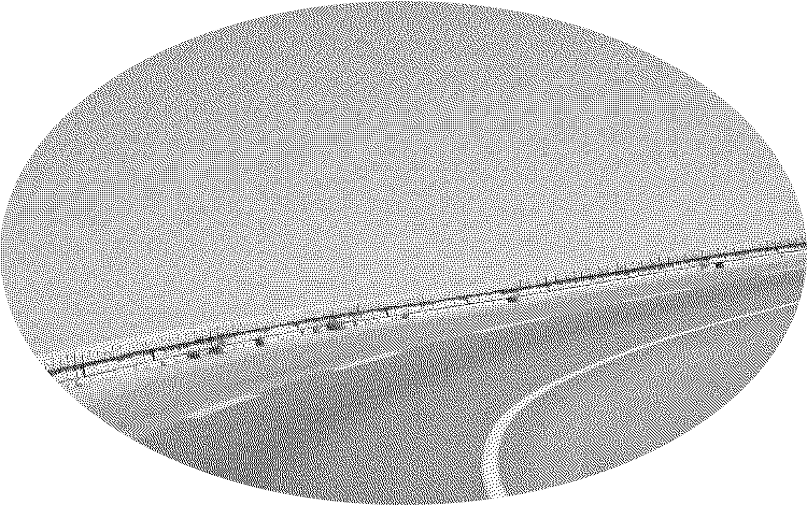

## Das Ende der Deadline

Es hört nicht auf. Der Druck, der beim analogen Publizieren von der unumstößlichen Deadline ausging, wird in der digitalen Welt zu einer kontinuierlichen Anstrengung. Digitale Produkte sind flüssig, können immer weiter verändert und angepasst werden. Feeds haben keinen Druckschluss oder Sendetermin, sie enden nicht, sondern sind endlos. Durch die Vernetzung und Verlinkung, wird die gesamte Veröffentlichung zu einem Prozess.

Um diese Entwicklungen zu verstehen, lohnt sich der Blick aufs gesamten Ökosystem (Netzwerk) und nicht mehr nur auf die einzelne Inhalte-Einheit (Werk), dann wird erkennbar, dass. Reaktionen und Rückbezüge Bestandteil der Kommunikation sind. Gemeinsam bilden ein Art Perpetuum mobile der Kommunikation, das von Aufmerksamkeit angetrieben wird. Der öffentliche Widerspruch gegen eine publizierte These ist ebenso Teil des Prozesses wie die Reaktionen in sozialen Medien.

Auf der Meta-Ebene lässt sch aus dieser Entwicklung schlussfolgern: Die Beschäftigung mit Innovation oder neuen Arbeitsformen ist kein Job für eine kurzfristiges Lab- oder Projektteam, sondern muss Bestandteil der operativen Organisation sein. 

Denn wer sich konsequent den sich ändernden Nutzungsbedürfnissen orientieren will, braucht einen Rahmen, um immer wieder auf Veränderungen reagieren zu können.

## Daran werde ich es 2022 erkennen:

Innovation ist kein abgeschlossener Prozess, es geht weiter. Immer weiter.

